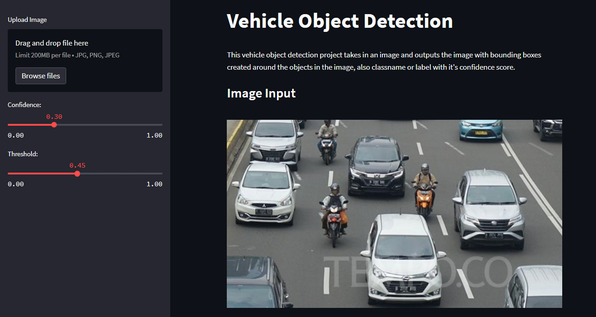

# vehicle Object Detection with YoloV5
This is Task Week 4 Internship at Nodeflux



### Build Image on Docker

```
$ docker build -t vehicle-detection:latest .
```

### Pull Image from Dockerhub

```
$ docker pull vehicle-detection:latest
```

### Run Image

```
$ docker run -it --rm -p 9000:8501 vehicle-detection:latest
```
